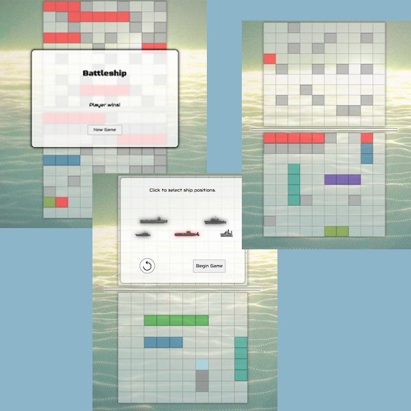

# Battleship

A recreation of the classic boardgame Battleship for mobile and desktop users. Players choose their ship placements by clicking on the bottom board. Pressing the spin button changes the axis which the ship aligns. Once game begins, players take turns against the computer by clicking on the enemy board to guess where enemy ship may be. Game is won once computer or player have sunk all 5 ships.

## Table of contents

- [Overview](#overview)
  - [The challenge](#the-challenge)
  - [Screenshot](#screenshot)
  - [Links](#links)
- [My process](#my-process)
  - [Built with](#built-with)
  - [What I learned](#what-i-learned)
  - [Continued development](#continued-development)

## Overview

### The challenge

Users should be able to:

- Choose where their ships are placed without allowing for invalid placement prior to gameflow
  - include ability to place ships horizontally or vertically
- Play against a computer opponent
  - computer opponent should have strategy and not play randomly
- Choose grid square for turn guess
- Track misses and hits on enemy board and player board
- Play a new game on gameover

- View the optimal layout for each page depending on their device's screen size
- See hover states for all interactive elements throughout the site
- Click the "About Me" call-to-action on the homepage and have the screen scroll down to the next section
- Receive an error message when the contact form is submitted if:
  - The `Name`, `Email Address` or `Message` fields are empty should show "This field is required"
  - The `Email Address` is not formatted correctly should show "Please use a valid email address"

Programming process should include:

- Focus on Test Driven Development
- Isolating application functionality in a modular design pattern
- Isolating DOM manipulation from game logic.

### Screenshot

### Links

- Live Site URL: [Add live site URL here](https://jessejputnam.github.io/battleship/)

## My process

### Built with

- Flexbox
- Mobile-first workflow
- Vanilla JavaScript
- [Jest](https://jestjs.io/) - Testing framework
- [Webpack](https://webpack.js.org/) - Module Bundler

### What I learned

Three challenges appeared to hinder my progress during production:

(1) Isolating what I wanted as a result of the test was difficult. I found often, at the beginnig especially, that my testing output would often test for a specific output rather than a general outcome. This led to issues with my tests looking for specific implementation over general outcome, forcing me to rewrite tests to accommodate for outcomes with less specific language.

- Thinking harder about what outcome I want rather than an expression of that outcome should enable me to write tests that are implementation agnostic, allowing me to use tests regardless of the underlying implementation changes.

(2) I found that I encoutered the need for new functionality as I was writing the visual interactive material. When these new functionalities presented themselves, I was deep in user DOM interaction, and found that, without paying attenition, I could sometimes couple my DOM interation too closely with my gaemflow logic.

- More thorough planning in the beginning should tease out the needed functions earlier. In the event that I encounter the need for new functionality in the middle of the project, taking time to abstract the functionality should lead to saved time later while coding.

(3) I waited until the end to enact the logic for allowing player choose ship placement. Because of decisions I made early on in how the ships were to be displayed, I had an issue in figuring out how to let players move those ships.

- Eventully, I settled on using mouseover events to change the background color of the hovered square as well as teh adjacent squares according to ship size.

### Continued development

- I want to continue working TDD and writing tests prior to writing code. It was annoying at first, but as I had to change ideas on the fly to work with the accidental implications of my earlier code, having tests immediately ready that were implementation agnostic made those late stage changes much faster.

- I want to look into more DOM manipulation, especially with drag and drop features. In retrospect, drag and drop could have been a more user friendly and visually impressive way of allowing users to choose ship positions.
